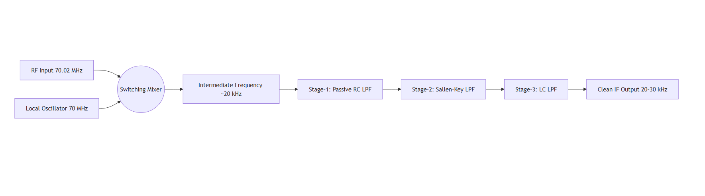
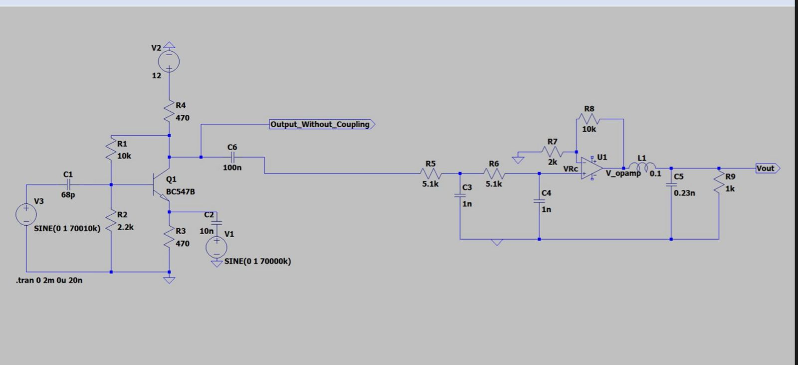
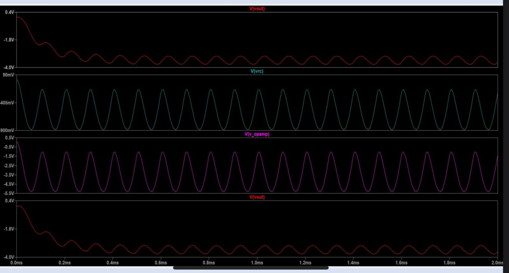
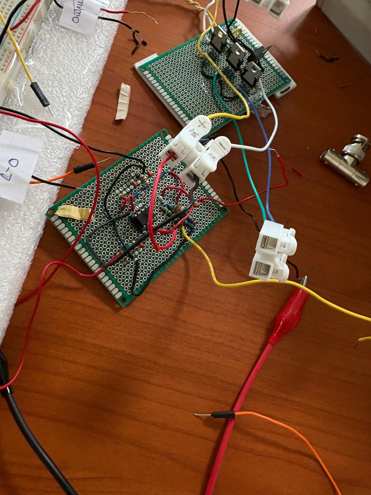
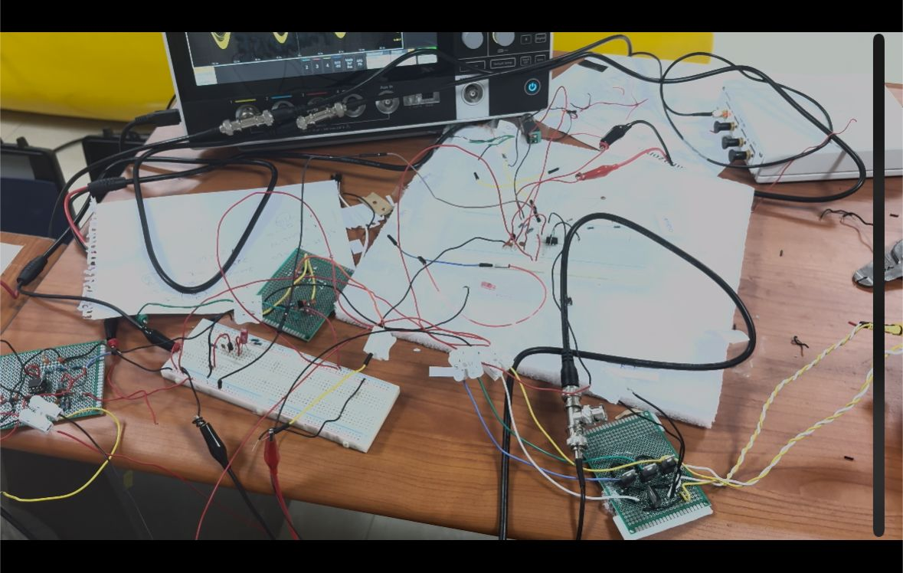

# High-Performance Precision RF Mixer and Multistage Cascaded Low-Pass Filter Design

## Introduction
In RF communication systems, signals are often transmitted and received at very high frequencies (tens of MHz).  
Direct processing of such high-frequency signals is difficult and inefficient.  
To solve this, a **mixer** is used to shift the frequency down to a manageable range, called the **Intermediate Frequency (IF)**.  
After mixing, unwanted high-frequency components are removed using **low-pass filters**.  

This project demonstrates the design of a **70 MHz BJT-based mixer** followed by a **multistage cascaded low-pass filter** that extracts a **clean IF signal in the 25–30 kHz range**.

---

✨ System Overview

**Pipeline:**  
1. **Mixer Stage (70 MHz input)** – Single-balanced BJT mixer.  
2. **Stage-1 Low-Pass Filter** – 2nd-order passive RC filter (rough shaping).  
3. **Stage-2 Low-Pass Filter** – 2nd-order Sallen–Key active filter (Op-Amp, sharper roll-off).  
4. **Stage-3 Low-Pass Filter** – 2nd-order LC filter (final cleanup for strong stopband rejection).  

Target: **Cutoff frequency = 28 kHz (±2 kHz)**

---

## 📦 Block Diagram

  

## Mixer Stage

- **Transistor:** BC547B (BJT in common-emitter configuration).  
- **Inputs:**  
  - RF input: ~70.01 MHz  
  - LO input: 70 MHz  
- **Output:**  
  - IF component at ~10 kHz (difference frequency)  
  - Along with higher-order mixing products (filtered later).

---

## Filter Design

### Stage-1: Passive RC (2nd-order)
- Provides initial attenuation of high-frequency components.  
- Simple and compact but limited roll-off.  

### Stage-2: Active Sallen–Key (2nd-order Op-Amp)
- Adds sharper cutoff and better control over frequency response.  
- Boosts the desired IF band (~25–30 kHz) while attenuating higher harmonics.  

### Stage-3: LC Low-Pass (2nd-order)
- Final cleanup stage for high-frequency suppression.  
- Ensures strong attenuation of mixer spurs and harmonics.  

---

## 📦 LT Spice Design
  

## Example Component Values (for ~28 kHz cutoff)

- **RC Stage:**  
  - R = 5.6 kΩ  
  - C = 1 nF  

- **Sallen–Key Stage:**  
  - R1 = 10 kΩ, R2 = 10 kΩ  
  - C1 = 560 pF, C2 = 560 pF  

- **LC Stage (with L = 0.1 H):**  
  - C ≈ 3.2 nF (tuned for ~28 kHz cutoff)  

---

## Simulation Results

- Mixer output shows downconversion of 70 MHz RF with 70 MHz LO to IF (~10 kHz).  
- Cascaded filtering stages progressively remove higher harmonics.  
- Final output has a **clean passband at ~25–30 kHz** with sharp attenuation above cutoff.

-  
  - 

---

## 🏗️ HardWare Design And Output

 

## Applications

- RF front-end design.  
- Communication receivers.  
- Educational demonstration of frequency conversion and multistage filtering.
